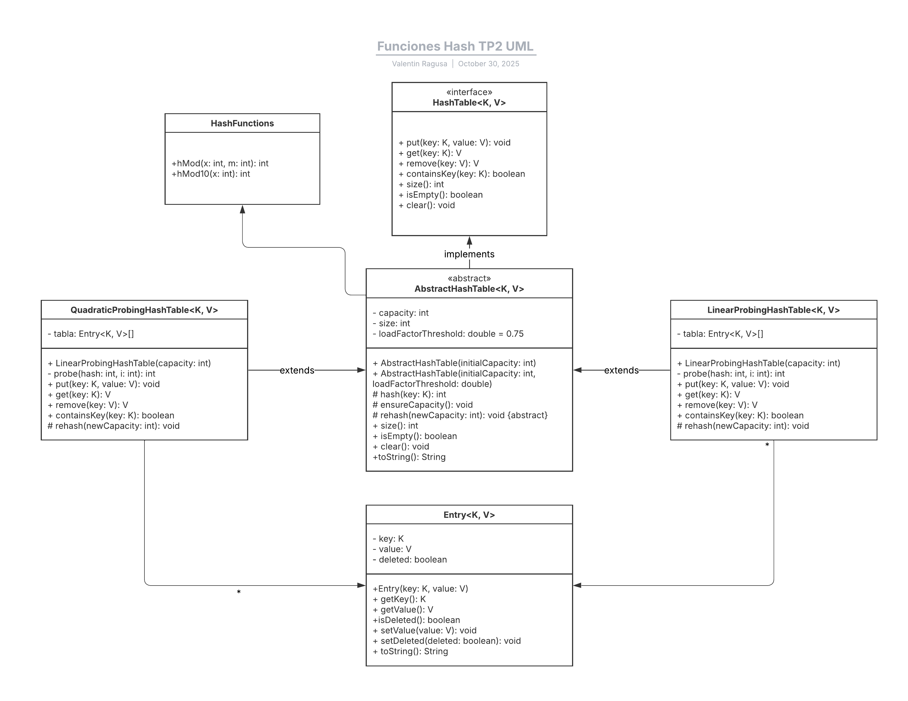

# Practical Work No. 2 – Hash Tables with Linear and Quadratic Probing
# Trabajo Práctico N.º 2 – Tablas Hash con Sondeo Lineal y Cuadrático

---

## 1. Introduction / Introducción

**English:**  
This project implements and analyzes two different collision resolution strategies in hash tables: **linear probing** and **quadratic probing**. The goal is to understand how each approach affects the efficiency of basic operations—such as search, insertion, and deletion—as well as the overall distribution and utilization of the hash table.

**Español:**  
Este proyecto implementa y analiza dos estrategias distintas de resolución de colisiones en tablas hash: **sondeo lineal** y **sondeo cuadrático**. El objetivo es comprender cómo cada enfoque afecta la eficiencia de las operaciones básicas —como búsqueda, inserción y eliminación—, así como la distribución y el aprovechamiento general de la tabla.

---

## 2. Project Structure / Estructura del Proyecto

| Class / Clase | Description / Descripción |
|----------------|---------------------------|
| `HashTable<K, V>` | Defines the interface for hash table operations. / Define la interfaz para las operaciones básicas de una tabla hash. |
| `AbstractHashTable<K, V>` | Abstract class implementing shared behavior such as resizing, hashing, and load factor control. / Clase abstracta que implementa el comportamiento común como el redimensionamiento, el hash y el control del factor de carga. |
| `LinearProbingHashTable<K, V>` | Implements collision resolution using linear probing. / Implementa la resolución de colisiones mediante sondeo lineal. |
| `QuadraticProbingHashTable<K, V>` | Implements collision resolution using quadratic probing. / Implementa la resolución de colisiones mediante sondeo cuadrático. |
| `Entry<K, V>` | Represents a key–value pair with a logical deletion flag. / Representa un par clave–valor con un indicador de borrado lógico. |
| `HashFunctions` | Provides modular hash functions used by all implementations. / Proporciona funciones hash modulares utilizadas por todas las implementaciones. |
| `Main` | Test class that demonstrates the use and behavior of both probing strategies. / Clase de prueba que demuestra el uso y comportamiento de ambas estrategias de sondeo. |

---

## 3. Operation and Behavior / Funcionamiento General

**English:**  
Each insertion calculates a base position using a modular hash function (`hMod`). When a collision occurs, the algorithm applies the corresponding probing method:
- Linear probing searches sequentially for the next available slot.
- Quadratic probing increases the step size quadratically (1², 2², 3², ...), reducing clustering.

The table uses **logical deletion**, marking removed entries without erasing them physically. The **`ensureCapacity()`** method monitors the load factor and triggers a **rehash** when it exceeds 0.75, doubling the capacity and redistributing all valid entries.

**Español:**  
Cada inserción calcula una posición base mediante una función hash modular (`hMod`). En caso de colisión, el algoritmo aplica el método de sondeo correspondiente:
- El sondeo lineal busca secuencialmente la siguiente posición libre.
- El sondeo cuadrático incrementa la distancia de búsqueda de forma cuadrática (1², 2², 3², ...), reduciendo la concentración de colisiones.

La tabla utiliza **borrado lógico**, marcando las entradas eliminadas sin borrarlas físicamente. El método **`ensureCapacity()`** controla el factor de carga y ejecuta un **rehash** cuando supera el 75 %, duplicando la capacidad y redistribuyendo las entradas válidas.

---

## 4. Results / Resultados

**English:**  
Experimental tests showed that both implementations maintain average-case performance close to **O(1)** for insertion and search.  
Linear probing exhibited primary clustering, leading to slower access times as the load factor increased.  
Quadratic probing achieved better key dispersion and more stable performance under high load factors.  
In both cases, the use of logical deletion and automatic rehashing preserved efficiency and ensured correct reinsertion of elements.

**Español:**  
Las pruebas experimentales mostraron que ambas implementaciones mantienen un rendimiento promedio cercano a **O(1)** en inserción y búsqueda.  
El sondeo lineal presentó agrupamientos primarios, lo que aumentó los tiempos de acceso a medida que crecía el factor de carga.  
El sondeo cuadrático logró una mejor dispersión de claves y un rendimiento más estable bajo alta ocupación.  
En ambos casos, el uso del borrado lógico y el rehash automático mantuvieron la eficiencia y garantizaron la correcta reinserción de los elementos.

---

## 5. UML Diagram / Diagrama UML

**English:**  
The following diagram illustrates the inheritance and implementation relationships among the system’s classes.  
It highlights the modular and extensible design achieved through abstraction and code reuse.

**Español:**  
El siguiente diagrama ilustra las relaciones de herencia e implementación entre las clases del sistema.  
Evidencia el diseño modular y extensible logrado mediante la abstracción y la reutilización de código.

*Figure 1 – UML Class Diagram (Valentín Ragusa, 2025)*  


---

## 6. Compilation and Execution / Compilación y Ejecución

**English:**  
Compile all files inside the `TP2` package:
```bash
javac TP2/*.java
